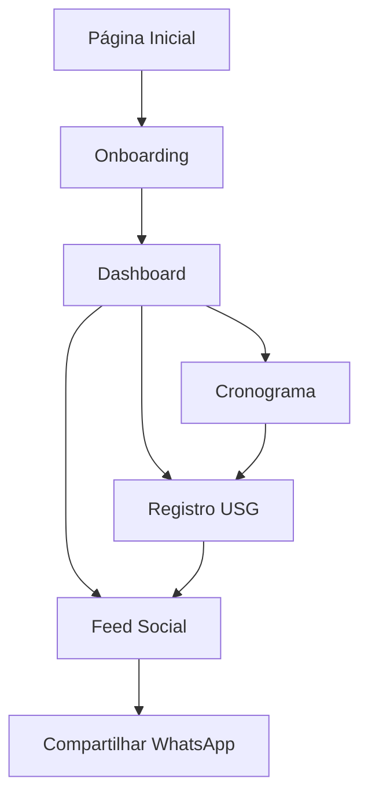

## 1. Visão Geral do Produto

O Gest Ultrassom Web é uma aplicação voltada para gestantes que permite o acompanhamento detalhado da gravidez através de um cronograma personalizado baseado na data da última menstruação (DUM) e data provável do parto (DPP). A plataforma facilita o gerenciamento de consultas e exames ultrassonográficos durante toda a gestação.

O produto resolve o problema de organização e acompanhamento médico durante a gravidez, sendo utilizado por gestantes que desejam manter-se informadas sobre as etapas importantes da gestação e compartilhar informações com seu círculo social através de integração com WhatsApp e Instagram.

## 2. Funcionalidades Principais

### 2.1 Papéis de Usuário
| Papel | Método de Registro | Permissões Principais |
|------|---------------------|------------------|
| Gestante | Cadastro com email e senha | Acessar cronograma, registrar USG, compartilhar informações |
| Visitante | Acesso sem cadastro | Visualizar informações básicas sobre o aplicativo |

### 2.2 Módulos de Funcionalidades

Nosso aplicativo Gest Ultrassom Web consiste nas seguintes páginas principais:

1. **Página de Onboarding**: coleta de nome, DUM e DPP para personalização da experiência
2. **Cronograma de Gestação**: visualização das semanas de gestação com janelas de exames recomendados
3. **Registro de Ultrassom**: formulário para adicionar dados do exame com correção automática da idade gestacional
4. **Feed Social**: visualização de posts com integração para compartilhamento via WhatsApp

### 2.3 Detalhamento das Páginas

| Nome da Página | Módulo | Descrição da Funcionalidade |
|-----------|-------------|---------------------|
| Onboarding | Formulário inicial | Coletar nome da gestante, data da última menstruação (DUM) e calcular automaticamente a DPP |
| Dashboard | Resumo da gestação | Exibir semana atual de gestação, dias até o parto e próximas consultas recomendadas |
| Cronograma | Timeline de exames | Mostrar janelas recomendadas para cada tipo de ultrassom (morfológico, translucência nucal, etc.) |
| Registro USG | Formulário de exame | Permitir upload de imagem, registro de medidas fetais e cálculo automático da idade gestacional corrigida |
| Feed Social | Posts compartilháveis | Criar cards visuais com informações da gestação e botão de compartilhamento direto para WhatsApp |
| Configurações | Perfil do usuário | Editar dados pessoais, ajustar DUM se necessário e preferências de notificação |

## 3. Fluxo Principal do Usuário

O fluxo começa com o onboarding onde a gestante insere seus dados básicos. Após o cadastro, ela é direcionada ao dashboard que mostra o resumo da gestação. A partir daí, pode navegar pelo cronograma para ver quando serão os próximos exames, registrar um ultrassom realizado com as medidas e imagens, e compartilhar momentos importantes através do feed social com integração ao WhatsApp.

## 4. Interface do Usuário

### 4.1 Estilo de Design
- **Cores principais**: Rosa suave (#FFB6C1) e roxo claro (#DDA0DD) para transmitir delicadeza e feminilidade
- **Cores secundárias**: Branco (#FFFFFF) e cinza claro (#F5F5F5) para áreas de conteúdo
- **Estilo de botões**: Arredondados com sombra suave para aspecto moderno e acolhedor
- **Tipografia**: Fonte sans-serif moderna (Inter ou Roboto) com tamanhos que variam de 14px para texto corrido até 24px para títulos principais
- **Layout**: Baseado em cards com bordas arredondadas e ícones minimalistas de coração, bebê e estrelas

### 4.2 Visão Geral das Páginas

| Página | Módulo | Elementos de UI |
|-----------|-------------|-------------|
| Onboarding | Formulário | Fundo gradiente suave, campos de entrada com labels amigáveis, botão principal destacado em rosa |
| Dashboard | Cards de informação | Cards empilhados mostrando semana atual, contador regressivo para parto e botões de ação rápida |
| Cronograma | Timeline vertical | Linha do tempo com marcadores circulares para cada exame, datas destacadas e status de conclusão |
| Registro USG | Formulário multi-etapa | Upload de imagem com preview, campos para medidas com validação automática e preview do card social |
| Feed Social | Grid de posts | Cards quadrados com imagem do ultrassom, semana de gestão e botão flutuante de compartilhamento |

### 4.3 Responsividade
A aplicação segue abordagem desktop-first com adaptação para tablets e smartphones. O layout se ajusta automaticamente com menu hambúrguer em telas menores que 768px e reorganização dos cards em coluna única para mobile.