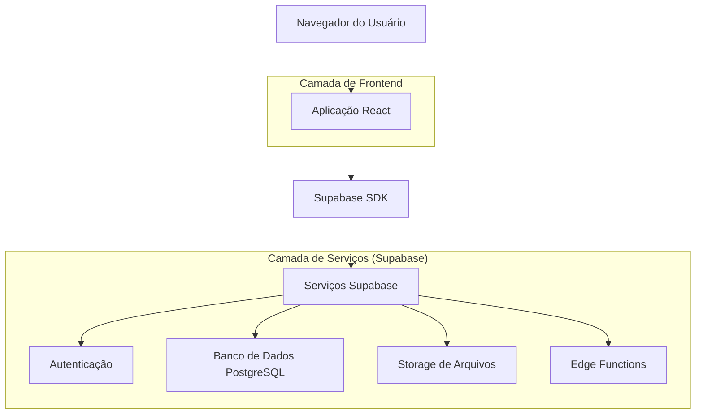
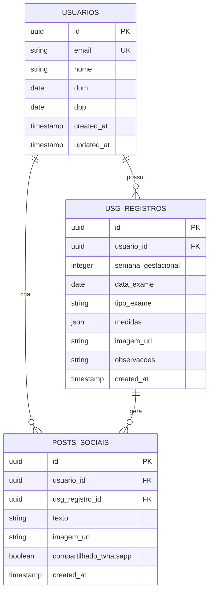

## 1. Arquitetura do Sistema



## 2. Tecnologias Utilizadas

- **Frontend**: React@18 + TypeScript + Tailwind CSS@3 + Vite
- **Ferramenta de Inicialização**: vite-init
- **Backend**: Supabase (BaaS - Backend as a Service)
- **Banco de Dados**: PostgreSQL (via Supabase)
- **Storage**: Supabase Storage para imagens de ultrassom
- **Deploy**: Vercel ou Netlify para frontend

## 3. Definições de Rotas

| Rota | Finalidade |
|-------|---------|
| / | Landing page com informações sobre o aplicativo |
| /onboarding | Cadastro inicial com DUM e dados da gestante |
| /dashboard | Painel principal com resumo da gestação |
| /cronograma | Timeline de exames recomendados |
| /registrar-usg | Formulário para adicionar novo exame |
| /feed | Posts sociais com ultrassons compartilhados |
| /configuracoes | Perfil e preferências do usuário |
| /login | Autenticação de usuários existentes |

## 4. Definições de API

### 4.1 Autenticação via Supabase

**Registro de novo usuário**
```typescript
// Utilizando Supabase Auth
const { data, error } = await supabase.auth.signUp({
  email: string,
  password: string,
  options: {
    data: {
      nome: string,
      dum: string, // ISO date string
      dpp: string  // ISO date string
    }
  }
})
```

**Login de usuário**
```typescript
const { data, error } = await supabase.auth.signInWithPassword({
  email: string,
  password: string
})
```

### 4.2 Operações de Dados

**Criar registro de ultrassom**
```typescript
POST /api/usg-registros

Request:
{
  semana_gestacional: number,
  data_exame: string,
  tipo_exame: string,
  medidas: {
    cc: number, // comprimento cefálico
    ca: number, // circunferência abdominal
    lf: number  // comprimento do fêmur
  },
  imagem_url: string,
  observacoes: string
}
```

**Buscar cronograma personalizado**
```typescript
GET /api/cronograma?dum={data}&semana_atual={numero}

Response:
{
  exames: [
    {
      tipo: string,
      semana_recomendada: number,
      janela_inicio: number,
      janela_fim: number,
      status: 'pendente' | 'realizado' | 'fora_de_epoca'
    }
  ]
}
```

## 5. Modelo de Dados

### 5.1 Definição das Entidades



### 5.2 DDL - Data Definition Language

**Tabela de usuários (users)**
```sql
-- Criar tabela de usuários (gerenciada pelo Supabase Auth)
-- Os dados adicionais são armazenados na coluna raw_user_meta_data

-- Tabela de registros de ultrassom
CREATE TABLE usg_registros (
    id UUID PRIMARY KEY DEFAULT gen_random_uuid(),
    usuario_id UUID REFERENCES auth.users(id) ON DELETE CASCADE,
    semana_gestacional INTEGER NOT NULL CHECK (semana_gestacional >= 4 AND semana_gestacional <= 44),
    data_exame DATE NOT NULL,
    tipo_exame VARCHAR(50) NOT NULL CHECK (tipo_exame IN ('morfologico', 'translucencia_nucal', 'doppler', 'crescimento', 'outro')),
    medidas JSONB,
    imagem_url TEXT,
    observacoes TEXT,
    created_at TIMESTAMP WITH TIME ZONE DEFAULT NOW(),
    updated_at TIMESTAMP WITH TIME ZONE DEFAULT NOW()
);

-- Tabela de posts sociais
CREATE TABLE posts_sociais (
    id UUID PRIMARY KEY DEFAULT gen_random_uuid(),
    usuario_id UUID REFERENCES auth.users(id) ON DELETE CASCADE,
    usg_registro_id UUID REFERENCES usg_registros(id) ON DELETE CASCADE,
    texto TEXT,
    imagem_url TEXT NOT NULL,
    compartilhado_whatsapp BOOLEAN DEFAULT FALSE,
    created_at TIMESTAMP WITH TIME ZONE DEFAULT NOW()
);

-- Índices para performance
CREATE INDEX idx_usg_registros_usuario_id ON usg_registros(usuario_id);
CREATE INDEX idx_usg_registros_data_exame ON usg_registros(data_exame DESC);
CREATE INDEX idx_posts_sociais_usuario_id ON posts_sociais(usuario_id);
CREATE INDEX idx_posts_sociais_created_at ON posts_sociais(created_at DESC);

-- Permissões RLS (Row Level Security)
ALTER TABLE usg_registros ENABLE ROW LEVEL SECURITY;
ALTER TABLE posts_sociais ENABLE ROW LEVEL SECURITY;

-- Políticas de segurança
-- Usuários autenticados podem ver apenas seus próprios registros
CREATE POLICY "Usuários veem próprios USG" ON usg_registros
    FOR SELECT USING (auth.uid() = usuario_id);

CREATE POLICY "Usuários criam próprios USG" ON usg_registros
    FOR INSERT WITH CHECK (auth.uid() = usuario_id);

CREATE POLICY "Usuários atualizam próprios USG" ON usg_registros
    FOR UPDATE USING (auth.uid() = usuario_id);

CREATE POLICY "Usuários deletam próprios USG" ON usg_registros
    FOR DELETE USING (auth.uid() = usuario_id);

-- Permissões para posts sociais
CREATE POLICY "Usuários veem próprios posts" ON posts_sociais
    FOR SELECT USING (auth.uid() = usuario_id);

CREATE POLICY "Usuários criam próprios posts" ON posts_sociais
    FOR INSERT WITH CHECK (auth.uid() = usuario_id);

-- Conceder permissões aos roles do Supabase
GRANT SELECT ON usg_registros TO authenticated;
GRANT INSERT ON usg_registros TO authenticated;
GRANT UPDATE ON usg_registros TO authenticated;
GRANT DELETE ON usg_registros TO authenticated;

GRANT SELECT ON posts_sociais TO authenticated;
GRANT INSERT ON posts_sociais TO authenticated;
```

### 5.3 Edge Functions

**Função para calcular idade gestacional corrigida**
```typescript
-- Edge Function: calcular-idade-gestacional
-- Trigger: Ao inserir novo USG, calcula idade gestacional baseada na DUM
-- e ajusta se necessário baseado nas medidas do feto

CREATE OR REPLACE FUNCTION calcular_idade_gestacional()
RETURNS TRIGGER AS $$
BEGIN
    -- Calcula semanas baseadas na DUM do usuário
    SELECT 
        EXTRACT(WEEKS FROM (NEW.data_exame - users.raw_user_meta_data->>'dum')::interval)
    INTO NEW.semana_gestacional
    FROM auth.users
    WHERE auth.users.id = NEW.usuario_id;
    
    RETURN NEW;
END;
$$ LANGUAGE plpgsql;

-- Trigger para executar a função antes de inserir
CREATE TRIGGER trigger_calcular_idade_gestacional
    BEFORE INSERT ON usg_registros
    FOR EACH ROW
    EXECUTE FUNCTION calcular_idade_gestacional();
```

## 6. Configurações de Segurança

### 6.1 Políticas de Armazenamento
```sql
-- Bucket para imagens de ultrassom
INSERT INTO storage.buckets (id, name, public) VALUES ('usg-images', 'usg-images', true);

-- Política para upload de imagens
CREATE POLICY "Usuários autenticados fazem upload" ON storage.objects
    FOR INSERT TO authenticated
    WITH CHECK (bucket_id = 'usg-images' AND auth.uid()::text = (storage.foldername(name))[1]);

-- Política para leitura de imagens públicas
CREATE POLICY "Imagens públicas são legíveis" ON storage.objects
    FOR SELECT TO anon
    USING (bucket_id = 'usg-images');
```

### 6.2 Configurações de CORS
```json
{
  "cors": {
    "allowed_origins": ["http://localhost:5173", "https://*.vercel.app"],
    "allowed_methods": ["GET", "POST", "PUT", "DELETE", "OPTIONS"],
    "allowed_headers": ["authorization", "content-type"]
  }
}
```